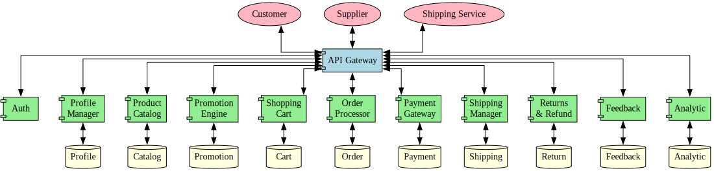

# Módulos Funcionales del sistema

• **Catálogo de Productos**
El módulo de Catálogo de Productos es la vitrina de la tienda: aquí los clientes pueden explorar, buscar y filtrar artículos, ver sus descripciones, precios e imágenes. Los administradores utilizan este espacio para agregar o actualizar productos, y los proveedores revisan niveles de stock y ajustan cantidades según sea necesario.

• **Carrito de Compras**
El Carrito de Compras guarda de forma temporal todos los productos que un cliente quiere adquirir. Permite añadir y quitar ítems, muestra un resumen de precios y cantidades, y prepara todo para confirmar la orden con un clic de “checkout”.

• **Procesamiento de Pedido**
En el Procesamiento de Pedido se materializa la compra: al confirmar el pago, se crea la orden, se reserva el stock correspondiente y se actualiza el estado del pedido (pendiente, en tránsito, entregado). Tanto el cliente como el administrador pueden seguir el avance y gestionar cambios o cancelaciones.

• **Pagos**
El módulo de Pagos se encarga de enviar la información de la tarjeta o pasarela, recibir la confirmación de la transacción y registrar cada cobro en el sistema. Además, gestiona los reembolsos cuando el cliente devuelve un producto y solicita la devolución del dinero.

• **Envíos**
El área de Envíos comunica la orden con el servicio de mensajería: genera guías, envía los datos al transportista, consulta el estado del envío y notifica al cliente cada vez que su paquete avanza en la ruta.

• **Devoluciones y Cambios**
Cuando un cliente necesita devolver o cambiar un artículo, este módulo valida las condiciones (plazo, estado del producto), coordina la logística inversa, actualiza el inventario y tramita el reembolso o envío del reemplazo.

• **Reseñas y Valoraciones**
Tras recibir su pedido, los clientes pueden dejar comentarios y puntuaciones que quedan almacenados aquí. Estas reseñas ayudan a futuros compradores a decidirse y generan confianza sobre la calidad de los productos.

• **Ofertas y Promociones**
Este módulo crea y gestiona descuentos, cupones y campañas especiales. Permite definir reglas (por ejemplo, “20% de descuento en electrónicos”), activar o pausar promociones y aplicarlas automáticamente en el carrito.

• **Atención al Cliente**
En Atención al Cliente se registran y responden las consultas o reclamaciones de usuarios. El equipo de soporte accede a un panel donde puede ver tickets, asignarlos, comunicarse con el cliente y cerrar cada incidencia.

• **Reportes y Forecasting**
Aquí se consolidan estadísticas de ventas y se generan gráficos e informes para administradores y proveedores. También se calculan previsiones de demanda, ayudando a planificar reabastecimientos y diseñar estrategias comerciales.

• **Gestión de Proveedores**
Este espacio ofrece al proveedor acceso a datos de inventario y pronósticos de venta. Así puede ajustar sus envíos y producción, poniendo a disposición nuevos lotes antes de que el stock se agote.

## Justificación de división



| Servicio                        | ¿Qué hace?                                                               | ¿Por qué lo aislamos?                                                                                 |
| ------------------------------- | ------------------------------------------------------------------------ | ----------------------------------------------------------------------------------------------------- |
| **Auth & Security**             | Registro, inicio de sesión, emisión de tokens y gestión de roles.        | Centraliza la seguridad y permite endurecer reglas de autenticación sin “tocar” la lógica de negocio. |
| **Profile Manager**             | Maneja datos de usuario: perfil, direcciones e historial de compras.     | Mantiene separados los datos personales de la parte transaccional para evitar mezclar contextos.      |
| **Product Catalog**             | Listado, búsqueda y detalle de productos, así como stock.                | Escalable independientemente, ideal para picos de navegación sin saturar la lógica de pedidos.        |
| **Promotions Engine**           | Crea y muestra ofertas, descuentos y cupones.                            | Ciclo de vida rápido y variable; aislarlo facilita pruebas y ajustes sin riesgos.                     |
| **Shopping Cart**               | Agrega/quita ítems y calcula totales antes del pago.                     | Su naturaleza temporal hace más sencillo limpiar datos obsoletos y optimizar rendimiento.             |
| **Order Processor**             | Recibe la orden, reserva stock, actualiza estados y notifica.            | Orquesta todo el flujo de compra; aislarlo evita cuellos de botella en el monolito.                   |
| **Payment Gateway Integration** | Comunica con pasarelas externas y gestiona reembolsos.                   | Los datos financieros exigen auditorías y controles propios, sin impactar otras áreas.                |
| **Shipment Manager**            | Genera envíos, consulta tracking y notifica al cliente.                  | Aísla la lógica de integración con transportistas para manejar timeouts y retries.                    |
| **Returns Handler**             | Procesa devoluciones e intercambios, valida políticas y reintegra stock. | Los flujos de devolución son complejos; mantenerlos separados mejora trazabilidad.                    |
| **Feedback Collector**          | Almacena y expone reseñas y calificaciones de productos.                 | Permite cacheo y escalado independiente sin sobrecargar bases de datos de pedidos.                    |
| **Analytics Dashboard**         | Genera reportes, métricas y pronósticos de ventas.                       | Cargas analíticas intensas no afectan la experiencia transaccional; corren en su propio entorno.      |

# Online Shopping System — Guía de Despliegue con Docker Compose

Esta guía explica cómo poner en marcha, de forma local, la arquitectura de microservicios para el sistema de compras en línea usando Docker y Docker Compose.

---

## Requisitos

Antes de empezar, asegúrate de tener instalado:

* **Docker** (versión 20 o superior)
* **Docker Compose** (versión 1.29 o superior)
* Un sistema operativo compatible (Linux, macOS o Windows)

---

## Estructura del proyecto

```
/ (raíz del repositorio)
├─ docker-compose.yml       # Configuración de servicios y bases de datos
├─ src/
│  ├─ product-catalog/      # Microservicio de catálogo de productos
│  │   ├─ Dockerfile
│  │   ├─ package.json
│  │   └─ código fuente...
│  ├─ promotions-engine/    # Motor de promociones
│  ├─ shopping-cart/        # Carrito de compras
│  ├─ order-processor/      # Procesador de pedidos
│  ├─ payment-gateway/      # Integración de pagos
│  ├─ shipment-manager/     # Gestión de envíos
│  ├─ returns-handler/      # Devoluciones e intercambios
│  ├─ feedback-collector/   # Reseñas y valoraciones
│  └─ analytics-dashboard/  # Reportes y pronósticos
└─ README.md                # Esta guía
```

Cada carpeta dentro de `src/` corresponde a un microservicio independiente con su propio Dockerfile.

---

## Contenido de docker-compose.yml

El archivo `docker-compose.yml` define los servicios y sus bases de datos PostgreSQL. A continuación los puertos que expone cada uno:

| Servicio            | Puerto API | Puerto DB |
| ------------------- | ---------- | --------- |
| product-catalog     | 3003       | 3503      |
| promotions-engine   | 3004       | 3504      |
| shopping-cart       | 3005       | 3505      |
| order-processor     | 3006       | 3506      |
| payment-gateway     | 3007       | 3507      |
| shipment-manager    | 3008       | 3508      |
| returns-handler     | 3009       | 3509      |
| feedback-collector  | 3010       | 3510      |
| analytics-dashboard | 3011       | 3511      |

Todas las bases de datos utilizan las credenciales:

```
usuario: postgres
contraseña: postgres
```

El nombre de cada base coincide con el microservicio correspondiente.

---

## Dockerfile base

Todos los microservicios comparten esta plantilla de Dockerfile. Solo recuerda ajustar el puerto expuesto con `EXPOSE`:

```dockerfile
FROM node:20-alpine
WORKDIR /usr/src/app
COPY package*.json ./
RUN npm install --production
COPY . .
EXPOSE 3001  # Cambia 3001 por el puerto de tu servicio
CMD ["node", "app.js"]
```

---

## Pasos para ejecutar

1. Clonar el repositorio y entrar en la carpeta:

   ```bash
   git clone https://github.com/tu-usuario/online-shopping-system.git
   cd online-shopping-system
   ```

2. Verificar instalación de Docker y Compose:

   ```bash
   docker --version
   docker-compose --version
   ```

3. Levantar todos los servicios:

   ```bash
   docker-compose up --build -d
   ```

4. Comprobar el estado de los contenedores:

   ```bash
   docker-compose ps
   ```

5. Probar un endpoint de ejemplo (salud de product-catalog):

   ```bash
   curl http://localhost:3003/health
   ```

6. Para detener y limpiar:

   ```bash
   docker-compose down
   ```

---

## Recomendaciones

* Si cambias puertos o variables de entorno, edita `docker-compose.yml` y los Dockerfiles de cada servicio.
* Para revisar logs de cualquier microservicio:

  ```bash
  docker-compose logs -f product-catalog
  ```
* Cada servicio incluye un endpoint `/health` para verificar su estado.

---

Con esta configuración tendrás todos los microservicios y sus bases de datos corriendo localmente, listos para pruebas y desarrollo.

---

## Lecciones aprendidas y desafíos enfrentados

1. **Hasta que todo hablara HTTP**: Al principio mezclé MQ y REST y me volví loco. Al pasar todo a HTTP entendí mejor el flujo y reduje el debugging a la mitad.

2. **No subestimes un Compose grande**: Tener 11 servicios en un mismo `docker-compose` arranque bien al principio, pero en la práctica hubo que repetir `up`, ajustar `depends_on` y esperar a que cada BD levantara sin fallar.

3. **Logs y monitoreo desde el día uno**: Aprendimos que sin endpoints de salud y logs centrales, investigar fallos en 11 servicios se vuelve una pesadilla. Añadir observabilidad temprano salvó muchas horas de debugging.
